# Hello World! I'm Akbar Pradana

---

  

---

## GitHub Analytics

  <table>
    <tr>
      <td rowspan="2">
        
      </td>
      <td>
        
      </td>
    </tr>
    <tr>
      <td>
        
      </td>
    </tr>
    <tr>
      <td>
        
      </td>
      <td>
        
      </td>
    </tr>
  </table>

---

## Contribution Snake

  

---

<h3 align="left"> Discord Presence</h3>
<a href="https://discord.com/users/619892255355830292">
    

  
---
