<!-- <h1 align="center">Hi 👋, I'm Akbar Pradana</h1> -->

  

 <table>
   <tr>
     <td rowspan="2">
       
     </td>
     <td>
       
     </td>
   </tr>
   <tr>
     <td>
       
     </td>
   </tr>
   <tr>
     <td>
       
     </td>
     <td>
       
     </td>
   </tr>
   <tr>
     <td>
       
     </td>
     <td>
       
     </td>
   </tr>
 </table>

  

